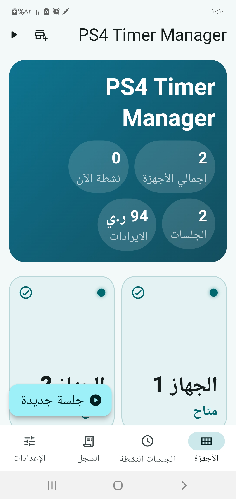
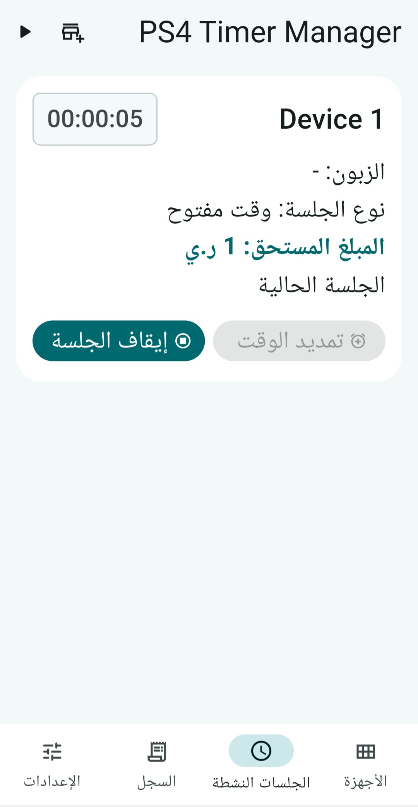
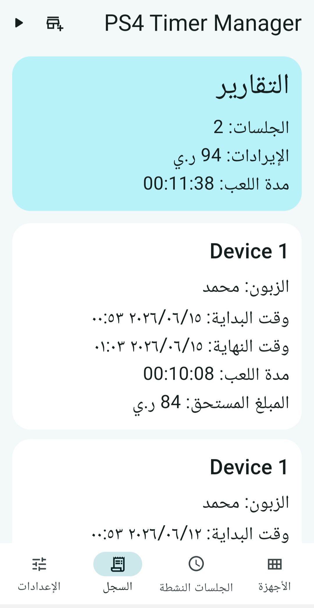
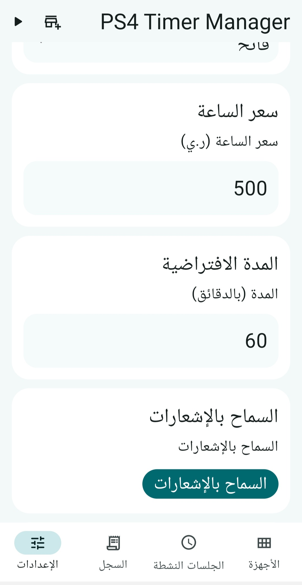

# 🎮 تطبيق إدارة مقاهي البلايستيشن (PS4 Timer Manager)

تطبيق متكامل للهواتف المحمولة تم تطويره باستخدام إطار عمل **Flutter** لتسهيل إدارة جلسات اللعب، حساب الإيرادات، وتنظيم أوقات العملاء في مقاهي ومحلات الألعاب.

## 🌟 مميزات التطبيق
يوفر التطبيق واجهة مستخدم سلسة باللغة العربية مع الميزات التالية:
* **لوحة تحكم شاملة:** عرض إجمالي الأجهزة المتاحة، الأجهزة النشطة حالياً، عدد الجلسات، وإجمالي الإيرادات اليومية[cite: 16].
* **إدارة الجلسات:** فتح جلسات لعب جديدة بسهولة (وقت مفتوح أو محدد)، تتبع الوقت المتبقي، وحساب المبلغ المستحق تلقائياً بناءً على سعر الساعة[cite: 17].
* **التقارير والسجل:** الاحتفاظ بسجل كامل للجلسات السابقة يتضمن اسم الزبون، وقت البداية والنهاية، مدة اللعب، والمبلغ المدفوع لتسهيل الجرد اليومي[cite: 18].
* **الإعدادات المرنة:** إمكانية تخصيص سعر الساعة الافتراضي، وتحديد المدة الافتراضية للجلسات، بالإضافة إلى التحكم بنظام الإشعارات[cite: 15].

## 📸 لقطات شاشة من التطبيق (Screenshots)

  
  
  
  

## 🚀 التقنيات المستخدمة
* **إطار العمل:** Flutter
* **لغة البرمجة:** Dart
* **واجهة المستخدم:** Material Design 3 بتصميم متجاوب ويدعم اللغة العربية (RTL).
